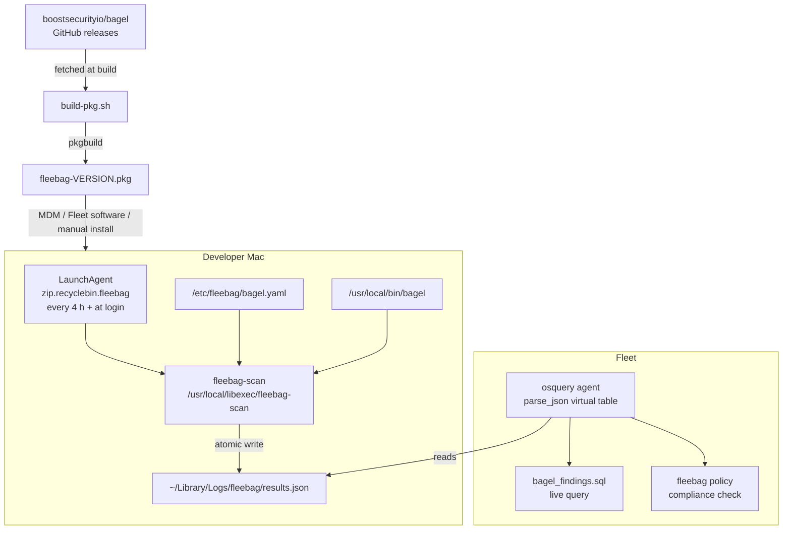

# fleebag

Deploy [bagel](https://github.com/boostsecurityio/bagel) to developer Macs via macOS PKG and surface secret-scanning results in [Fleet](https://github.com/fleetdm/fleet).

 

---

> **Proof of concept — not for production use.**
> This project demonstrates *that* you can scan developer laptops for exposed secrets and surface compliance posture in Fleet. It is not hardened for production deployment: the `bagel` binary ships with only an ad-hoc linker signature, the PKG is unsigned by default, and the PPPC profile cannot be populated with a stable `CodeRequirement` until the binary is re-signed with your own Developer ID certificate. Treat this as a reference implementation. Adapt the signing, packaging, and profile steps to your organisation's infrastructure before deploying at scale.

---

## Overview

**fleebag** packages the [bagel](https://github.com/boostsecurityio/bagel) open-source secret scanner into a macOS installer (`.pkg`) that runs automatically on developer laptops via a LaunchAgent. Scan results are written as JSON and queried by Fleet's osquery agent, letting you see detected secrets across your entire fleet and enforce a compliance policy — all without touching each machine manually.



- **bagel** ([boostsecurityio/bagel](https://github.com/boostsecurityio/bagel)) — open-source workstation secret scanner
- **Fleet** ([fleetdm/fleet](https://github.com/fleetdm/fleet)) — osquery-based device management and policy platform

---

## Prerequisites

- macOS 12 (Monterey) or later
- Xcode Command Line Tools — provides `pkgbuild`:
  ```sh
  xcode-select --install
  ```
- `python3` — pre-installed on macOS
- `curl` — pre-installed on macOS
- Internet access to `api.github.com` and `github.com` (to fetch the latest bagel release)
- A Fleet instance with the fleetd agent deployed (required for the `parse_json` virtual table used by the queries)
- Optional: `osqueryi` for local query testing (`brew install osquery`)

---

## Building the PKG

From the repo root, run:

```sh
bash scripts/build-pkg.sh
```

The script will:
1. Detect your Mac's architecture (`arm64` or `x86_64`)
2. Fetch the latest bagel release metadata from the GitHub API
3. Download and extract the arch-specific `bagel_Darwin_<arch>.tar.gz` tarball
4. Run `pkgbuild` to assemble the installer

**The bagel binary is not stored in this repository** — it is always fetched from the latest GitHub release at build time.

Expected output:
```
build/fleebag-<version>.pkg
```

### Distributing the PKG

The `.pkg` can be distributed via:
- **MDM** (e.g., Jamf, Mosyle, Kandji) — upload and scope to your developer population
- **Fleet software management** — upload via Fleet's built-in software deployment (Settings → Software)
- **Manual install** — `sudo installer -pkg build/fleebag-<version>.pkg -target /`

### Signing the bagel binary

The `bagel` binary downloaded from the upstream GitHub release carries only an ad-hoc linker signature (`flags=adhoc`, `Identifier=a.out`, `TeamIdentifier=not set`). This means:

- The binary has no stable code-signing identity that macOS can verify.
- The PPPC profile's `CodeRequirement` can only be expressed as a `cdhash` tied to that exact build — it will break every time bagel is updated.
- Some MDMs and endpoint security tools treat ad-hoc-signed binaries as unverified third-party code.

**The recommended path** is to re-sign the bagel binary with your own **Developer ID Application** certificate before packaging it. This gives it a stable, certificate-anchored identity that survives version updates (as long as you use the same team certificate):

```sh
# List Developer ID Application identities in your keychain
security find-identity -v -p codesigning | grep "Developer ID Application"

# Re-sign the binary (replace TEAMID and org name with your own)
codesign --force --options runtime \
  --sign "Developer ID Application: Your Name (TEAMID)" \
  pkg/payload/usr/local/bin/bagel

# Verify
codesign -dv --verbose=4 pkg/payload/usr/local/bin/bagel
```

After re-signing, derive the `CodeRequirement` that you will paste into the PPPC profile:

```sh
codesign -dr - pkg/payload/usr/local/bin/bagel 2>&1 | grep 'designated =>'
```

Example output for a properly signed binary:
```
designated => identifier "bagel" and anchor apple generic and
  certificate 1[field.1.2.840.113635.100.6.2.6] /* exists */ and
  certificate leaf[field.1.2.840.113635.100.6.1.13] /* exists */ and
  certificate leaf[subject.OU] = "XXXXXXXXXX"
```

This string is stable across future bagel releases as long as you re-sign each new version with the same Developer ID cert. Paste it into `profiles/fleebag-full-disk-access.mobileconfig` as the `CodeRequirement` value. See [Preparing the profile](#preparing-the-profile) for details.

> **Without re-signing:** if you skip this step, the only valid `CodeRequirement` is a `cdhash` (`cdhash H"<hash>"`), which must be updated in the profile every time you ship a new version of bagel. For a proof-of-concept this is acceptable; for production it is unworkable.

### Signing the PKG

The PKG produced by `build-pkg.sh` is unsigned. macOS Gatekeeper will block or warn on unsigned PKGs for standard users, and some MDM vendors validate PKG signatures before deployment. Signing is **not automated in this repo** because it requires an Apple Developer ID Installer certificate, which is specific to your organisation's Apple Developer account.

If you have a Developer ID certificate, sign the built PKG with `productsign` before distributing it:

```sh
# List available signing identities to find your Developer ID Installer certificate
security find-identity -v -p basic | grep "Developer ID Installer"

# Sign the PKG
productsign \
  --sign "Developer ID Installer: Your Name (TEAMID)" \
  build/fleebag-<version>.pkg \
  build/fleebag-<version>-signed.pkg
```

After signing, verify the signature:

```sh
pkgutil --check-signature build/fleebag-<version>-signed.pkg
```

**Notarization** (required for distribution outside MDM to standard users on macOS 13+) is a separate step after signing — submit the signed PKG to Apple's notarisation service with `notarytool`, then staple the ticket:

```sh
xcrun notarytool submit build/fleebag-<version>-signed.pkg \
  --apple-id "you@example.com" \
  --team-id "TEAMID" \
  --password "@keychain:AC_PASSWORD" \
  --wait

xcrun stapler staple build/fleebag-<version>-signed.pkg
```

For MDM deployment (Jamf, Mosyle, Kandji, Fleet software management), signing is sufficient — notarisation is not required because MDM bypasses Gatekeeper quarantine.

---

## Installation

The PKG installs the following files:

| Path | Description |
|---|---|
| `/usr/local/bin/bagel` | The bagel scanner binary |
| `/usr/local/libexec/fleebag-scan` | Wrapper script that handles logging and atomic output |
| `/etc/fleebag/bagel.yaml` | Bagel configuration (probes, privacy controls, output options) |
| `/Library/LaunchAgents/zip.recyclebin.fleebag.plist` | LaunchAgent — runs every 4 hours and at login |

The postinstall script sets correct permissions and bootstraps the LaunchAgent for the current user session immediately after installation.

**Scan results** are written to:
```
~/Library/Logs/fleebag/results.json
```

Each user on the Mac has their own results file under their home directory.

### Manual Scan Trigger

To run a scan immediately without waiting for the 4-hour interval:

```sh
launchctl kickstart -k gui/$(id -u)/zip.recyclebin.fleebag
```

### Check LaunchAgent Status

```sh
launchctl print gui/$(id -u)/zip.recyclebin.fleebag
```

---

## Full Disk Access

macOS TCC (Transparency, Consent, and Control) restricts reads on sensitive locations — `~/Desktop`, `~/Documents`, `~/Downloads`, `~/Library`, shell history files, SSH keys, cloud credential files, and more. Without Full Disk Access, bagel will silently receive permission-denied errors on most of the locations it needs to scan, producing incomplete or empty results.

Full Disk Access must be granted via an MDM configuration profile (PPPC payload). **It cannot be granted interactively by the user for a background LaunchAgent process.**

A sample profile is provided at `profiles/fleebag-full-disk-access.mobileconfig`.

### Preparing the profile

The profile requires two values that are specific to your environment:

**1. UUIDs** — generate two unique identifiers:
```sh
uuidgen   # run twice; paste results into PAYLOAD-UUID-1 and PAYLOAD-UUID-2
```

**2. CodeRequirement** — the code signing requirement for the bagel binary.

The value you use here depends on how bagel is signed:

- **If you re-signed bagel with your Developer ID Application cert** (recommended — see [Signing the bagel binary](#signing-the-bagel-binary)): run the following on a Mac where the re-signed bagel is installed and paste everything after `designated => ` into the profile. This value is stable across bagel version updates.

  ```sh
  codesign -dr - /usr/local/bin/bagel 2>&1 | grep 'designated =>'
  ```

  Example output:
  ```
  designated => identifier "bagel" and anchor apple generic and
    certificate 1[field.1.2.840.113635.100.6.2.6] /* exists */ and
    certificate leaf[subject.OU] = "XXXXXXXXXX"
  ```

- **If you are using the upstream ad-hoc-signed binary as-is** (proof-of-concept only): the only valid `CodeRequirement` is the binary's `cdhash`, which changes with every bagel release. Obtain it with:

  ```sh
  codesign -dr - /usr/local/bin/bagel 2>&1
  # Look for: # designated => cdhash H"<hash>"
  # Use: cdhash H"<hash>"
  ```

  You must update this value in the profile — and redeploy via MDM — every time you install a new version of bagel.

> **Recommendation:** Re-sign the binary before packaging to avoid the per-version redeploy cycle. See [Signing the bagel binary](#signing-the-bagel-binary).

### Deploying the profile

Sign the profile with your MDM signing certificate (if required by your MDM vendor), then upload and scope it to the same device population as the fleebag PKG. The profile must be deployed **before or alongside** the PKG — bagel will fail to scan protected paths until FDA is active.

---

## Fleet Queries

Two SQL files in `queries/` are ready to paste into Fleet.

### Findings Query (`queries/bagel_findings.sql`)

**Purpose:** Live query — returns every secret finding from every managed Mac, with severity, rule ID, affected file path, and the timestamp of the last scan.

**How to add in Fleet:** Settings → Queries → New query → paste the SQL below.

```sql
SELECT
    REPLACE(REPLACE(pj.path, '/Library/Logs/fleebag/results.json', ''), '/Users/', '') AS username,
    MAX(CASE WHEN pj.key = 'severity' THEN pj.value END) AS severity,
    MAX(CASE WHEN pj.key = 'id'       THEN pj.value END) AS rule_id,
    MAX(CASE WHEN pj.key = 'path'     THEN pj.value END) AS file_path,
    MAX(CASE WHEN pj.key = 'line'     THEN pj.value END) AS line_number,
    datetime(f.mtime, 'unixepoch')                        AS last_scan
FROM parse_json pj
LEFT JOIN file f ON f.path = pj.path
WHERE pj.path LIKE '/Users/%/Library/Logs/fleebag/results.json'
  AND pj.parent LIKE 'findings/%'
GROUP BY pj.path, pj.parent
ORDER BY
    CASE MAX(CASE WHEN pj.key = 'severity' THEN pj.value END)
        WHEN 'critical' THEN 1
        WHEN 'high'     THEN 2
        WHEN 'medium'   THEN 3
        WHEN 'low'      THEN 4
        ELSE                 5
    END,
    pj.path;
```

**Output columns:**

| Column | Description |
|---|---|
| `username` | macOS short username whose results file contained the finding |
| `severity` | Lowercase severity: `critical`, `high`, `medium`, or `low` |
| `rule_id` | Machine-readable rule name (e.g., `git-ssl-verify-disabled`) |
| `file_path` | Location of the affected file or config (may be NULL for some rules) |
| `line_number` | Line number (always NULL — not in bagel's schema; reserved for future use) |
| `last_scan` | ISO 8601 timestamp of when the results file was last written |

---

### Policy Query (`queries/bagel_policy.sql`)

**Purpose:** Automated policy — evaluates whether a device is compliant (scan is current, no critical secrets detected).

**How to add in Fleet:** Policies → Add policy → paste the SQL below.

**Fleet policy semantics:** Returns ≥ 1 row = **PASS**; returns 0 rows = **FAIL**.

```sql
WITH local_users AS (
    SELECT
        username,
        directory || '/Library/Logs/fleebag/results.json' AS results_path
    FROM users
    WHERE uid  >= 500
      AND directory LIKE '/Users/%'
),

valid_users AS (
    SELECT lu.username
    FROM local_users lu
    JOIN file f
        ON f.path = lu.results_path
    WHERE
        (strftime('%s', 'now') - f.mtime) < 604800
        AND NOT EXISTS (
            SELECT 1
            FROM parse_json pj
            WHERE pj.path   = lu.results_path
              AND pj.key    = 'severity'
              AND pj.parent LIKE 'findings/%'
              AND pj.value  = 'critical'
        )
)

SELECT
    'pass'      AS result,
    vu.username AS username
FROM valid_users vu
WHERE
    (SELECT COUNT(*) FROM valid_users)  = (SELECT COUNT(*) FROM local_users)
    AND (SELECT COUNT(*) FROM local_users) > 0
LIMIT 1;
```

**Pass/fail logic:**

| Outcome | Condition |
|---|---|
| **PASS** | `results.json` exists, was written within the last 7 days, and contains no `critical`-severity findings — for every local user on the device |
| **FAIL** | `results.json` is missing or stale (> 7 days old), or contains one or more `critical`-severity findings, for any local user |

**Recommended Fleet remediation actions:**
- Notify the device owner via Fleet's built-in email/Slack notification
- Create a ticket in your issue tracker using Fleet's automation rules
- For persistent failures, scope a re-deployment of the PKG via MDM or Fleet software management

---

## Configuration

The installed configuration file is `/etc/fleebag/bagel.yaml`. It controls which probes run, privacy settings, and output options.

### Enabling or disabling probes

Edit `pkg/payload/etc/fleebag/bagel.yaml` before building the PKG. Set `enabled: false` under any probe to skip it:

```yaml
probes:
  git:
    enabled: true
  ssh:
    enabled: true
  npm:
    enabled: true
  env:
    enabled: true
  shell_history:
    enabled: false   # disable if shell history scanning is not desired
  cloud:
    enabled: true
  jetbrains:
    enabled: true
  gh:
    enabled: true
  ai_credentials:
    enabled: true
  ai_chats:
    enabled: false   # disable if AI chat history scanning is not desired
```

### Privacy controls

To suppress findings in specific paths (e.g., a password manager database):

```yaml
privacy:
  redact_paths:
    - "~/.password-store/**"
  exclude_env_prefixes:
    - "MY_INTERNAL_"
```

### Adjusting the scan interval

The LaunchAgent runs every 4 hours by default (`StartInterval: 14400`). To change this, edit `pkg/payload/Library/LaunchAgents/zip.recyclebin.fleebag.plist` before building the PKG:

```xml
<key>StartInterval</key>
<integer>14400</integer>   <!-- seconds; 3600 = 1 h, 86400 = 24 h -->
```

### Changing the output path

The results file path is hardcoded in `pkg/payload/usr/local/libexec/fleebag-scan` (`LOG_DIR` variable). If you change it, update `queries/bagel_findings.sql` and `queries/bagel_policy.sql` to match — both queries derive the results path from the user's home directory using the same pattern.

---

## Testing

The test suite validates the osquery query logic against four fixture scenarios without requiring a Fleet instance.

> **Limitation — parse_json is not tested locally.**
> `parse_json` is a Fleet extension table that ships with `fleetd`; it is not present in the stock `osqueryi` binary installed via Homebrew. The test runner therefore reimplements the query logic in Python and uses `osqueryi` only to smoke-test the standard `file` table. SQL structural issues — such as CTE-derived columns breaking `parse_json`'s virtual-table constraint pushdown — will not be caught by this suite. Full end-to-end validation requires running the queries against a real Fleet instance with `fleetd` installed.

### Prerequisites

- `python3` (standard on macOS)
- `osqueryi` for smoke tests (optional): `brew install osquery`

### Run the tests

```sh
./tests/update_timestamps.sh && ./tests/run_tests.sh
```

`update_timestamps.sh` must be run first — it sets the fixture file modification times to simulate fresh (now) and stale (8 days ago) scans.

### Fixture scenarios

| Fixture | Findings present | Policy result |
|---|---|---|
| `no_critical_fresh.json` | Yes (high/medium/low) | **PASS** — fresh scan, no critical findings |
| `no_critical_stale.json` | Yes (high/medium/low) | **FAIL** — scan is stale (> 7 days) |
| `critical_fresh.json` | Yes (includes critical) | **FAIL** — critical findings present |
| `critical_stale.json` | Yes (includes critical) | **FAIL** — stale and has critical findings |

### Expected output

```
=== Results: 8/8 passed ===
All 8 assertions passed.
```

---

## License

See [LICENSE](LICENSE).
